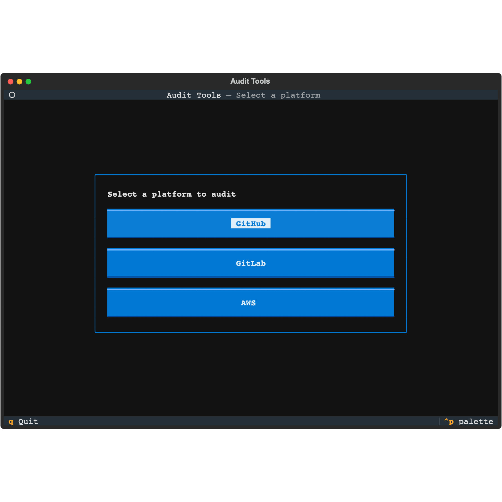
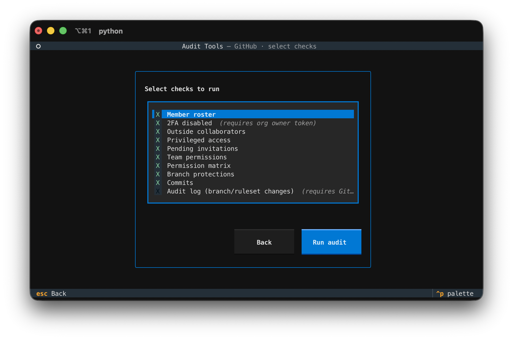
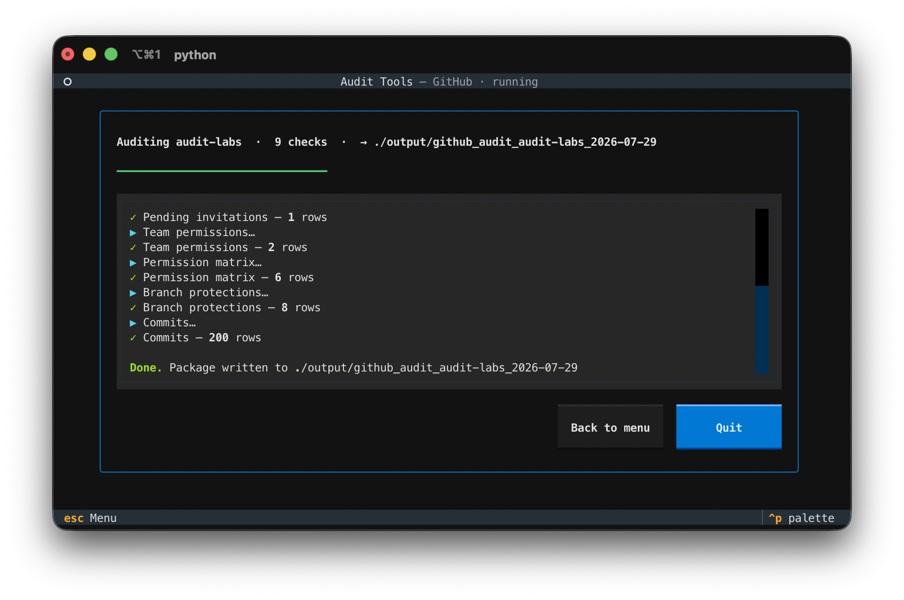

# Audit Tools — Interactive TUI

A terminal UI that walks you through running an audit. It presents a platform
menu, collects connection details and check selection, then runs the existing
collectors with live progress.

GitHub, GitLab, and AWS are supported. Adding a platform is a matter of writing
a runner and a `Platform` descriptor in `tui/platforms.py` — the screens are
platform-agnostic.

| Pick a platform | Choose checks | Watch it run |
|---|---|---|
|  |  |  |

## Run it

```bash
pip install -r requirements.txt
python audit_tui.py
```

The connection fields are pre-filled from environment variables if set:

```bash
# GitHub
export GITHUB_ORG=my-org
export GITHUB_TOKEN=ghp_...     # needs read:org and repo scopes

# GitLab
export GITLAB_GROUP=my-group
export GITLAB_TOKEN=glpat-...   # needs read_api scope
export GITLAB_URL=https://gitlab.example.com/api/v4   # self-hosted only

# AWS (credentials come from the standard AWS chain, not a form field)
export AWS_PROFILE=my-profile
export AWS_DEFAULT_REGION=us-east-1
export AWS_AUDIT_ACCOUNT=my-account   # optional; only for the SSO check
```

AWS never asks for an access key in the UI — it uses your configured profile /
credential chain (env vars, `~/.aws`, SSO). Read-only permissions are enough.

## Walkthrough

1. **Platform** — choose GitHub or GitLab.
2. **Connection** — the audit subject (org / group), a masked token, and any
   platform-specific fields (branch for GitHub; API base URL for GitLab).
3. **Checks** — toggle which checks to run. Plan-restricted checks (GitHub's
   Enterprise audit log; GitLab's Premium and self-hosted checks) are off by
   default.
4. **Run** — a progress bar and live log show each check completing with its row
   count. Errors on a single check are reported without stopping the run.

## Output

The TUI writes the same package the platform's `audit.py` produces —
`github_audit_<org>_<date>/`, `gitlab_audit_<group>_<date>/`, or
`aws_audit_<profile>_<date>/` under the output directory — one CSV per check
plus a `summary.txt`. It reuses each platform's collectors and CSV reporter
unchanged; the TUI is only an interactive driver around them.

## Keys

- `Esc` — back / return to menu
- `Ctrl+P` — command palette
- `q` — quit (from the menu)

## Tests

```bash
python -m pytest tui/tests
```

The tests stub the network-bound collectors, so they run offline: one suite
covers the run orchestration, another drives the app headlessly through every
screen.
